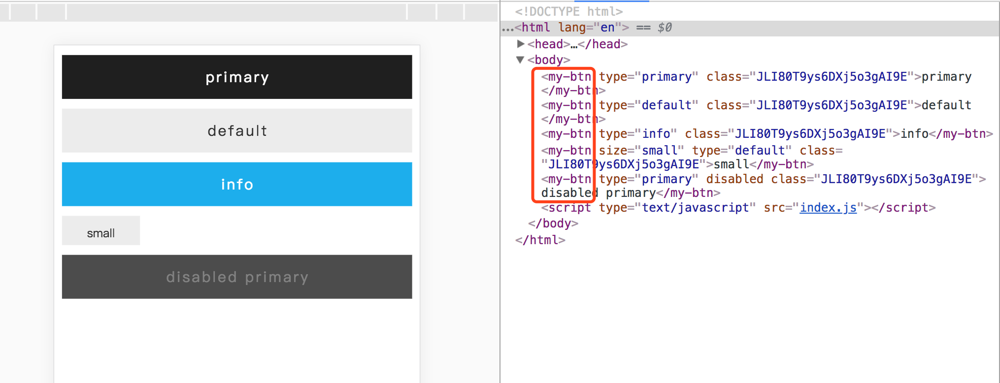
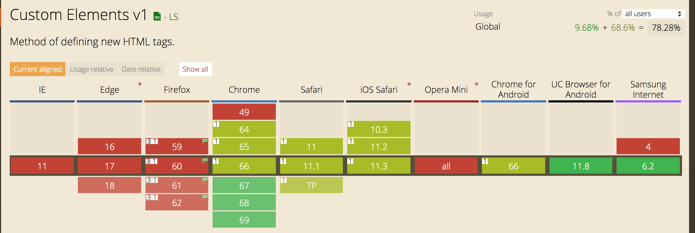

# 关于用户自定义标签

#### 参考资料
+ [MDN: Using_custom_elements](https://developer.mozilla.org/en-US/docs/Web/Web_Components/Using_custom_elements)
+ [https://dom.spec.whatwg.org/#interface-element](https://dom.spec.whatwg.org/#interface-element)

::: tip
One of the key features of the Web Components standard is the ability to create custom elements that encapsulate your functionality on an HTML page, rather than having to make do with a long, nested batch of elements that together provide a custom page feature. 
:::
web组件标准中很重要的一点是提供封装自定义标签的能力，这样就能避免写一大堆冗长的html来实现一个功能。
## 基本使用
用户自定义html标签必须定义一个类去继承HTMLElement，在类中可以使用this来进行样式操作，属性操作等。
我在这里自定义一个my-btn标签。
```javascript
import styles from './btn.styl';

class Btn extends HTMLElement {
  constructor() {
    super();
    this.classList.add(styles.btn);
  }
}

customElements.define('my-btn', Btn); // 注册， 第一个参数是标签名称

```
在btn.styl中给这个标签加样式： 

```css
.btn
  width: 100%
  height: 3em
  font-size: $fs1
  display block
  border-radius: 0
  &[size=small]
    hPadding = 4/3em
    padding: 0 hPadding
    width: fit-content
  &[type=primary]
    background-color: $palette.primary2
    color: $palette.default0
    &:active
      background-color: $palette.primary1
      color: $palette.default0
    &[disabled]
      background-color: $palette.primary3
      color: $textPalette.primary2
  &[type=info]
    background-color: $palette.info0
```
最终的效果大致如下，在右侧HTML部分可以看到`<my-btn>`标签：


## 一些操作
这里并不对custom element的详细用法一一描述，这篇[mdn文档](https://developer.mozilla.org/en-US/docs/Web/Web_Components/Using_custom_elements)已经有很详细的说明了。
这里简要列举一下在自定义标签的时候可以做哪些操作：
### 监听属性变化
1. 可以在Btn类中实现 `static get observedAttributes()` 方法，返回一个需要监听的属性名称数组。
2. 可以添加`attributeChangedCallback(name, oldValue, newValue)`方法，当监听的属性发生变化时，会自动执行此方法。

### 其他生命周期钩子

+ connectedCallback： 当我们自己定义的元素插入到页面中时，执行此回调
+ disconnectedCallback： 元素从DOM中移除
+ adoptedCallback： 元素被移动到新的页面（没用过这个回调）

## 踩坑

1. **自定义的元素名称必须包含`_`，使用单个单词是不可以的**
2. 自定义的元素默认display为 `inline`

## polyfill
关于用户自定义元素的浏览器支持情况如下：


可见IE、Firefox浏览器完全不支持。这个时候可以在项目中引入下面的polyfill：`document-register-element`


