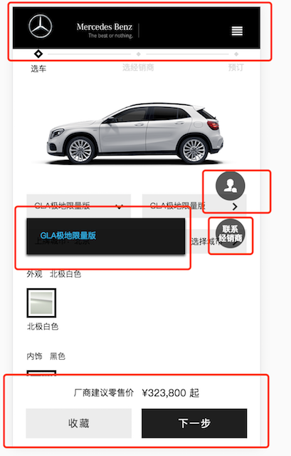

# 如何管理项目中的z-index
## 背景
今天项目临上线前QA发现了一个bug，当展开侧边栏的时候，悬浮的button挡住了侧边栏。开发团队接到bug之后，花了不到一分钟调整了一下侧边栏的z-index然后就解决了问题。

## 现状
之前项目组已经察觉到项目中的z-index已经失控了。大家统计了一下，可能悬浮的元素有这些：

  1. page header/footer
  2. menu弹层
  3. 隐私条款弹层
  4. 页面悬浮图标（返回顶部、客服）
  5. button系列（页面悬浮按钮）
  6. 确认弹框等
  7. 弹出的视频播放
  8. 报错信息悬浮
  9. drop down组件
  
  
  以上图的选车页面为例，页面中header和footer是固定在顶部和底部的。页面中间的联系客服和联系经销商的图片也是fixed在页面中央。当点击右上角的图标时，需要在右侧展开个人中心。
  那么这个页面有这么几条规则： 
  1. 页面中的dropdown不应该遮住联系客服图标；
  2. dropdown跟header或者footer重叠时，显示在下面（个人喜好）
  3. 用户展开个人中心时，侧边栏要盖住footer、客服、dropdown等。
  4. 有阅读条款的弹框和蒙层时，蒙层盖住页面个各种元素。
  
  。。。。。。。已经开始晕了。。。。。
  
  ## 之前解决方案
  当前项目中用stylus定义了下面几个z-index取值：
  ```stylus
// for z-index
$stackTop = 99999
$stackMiddle = 10
$stackBottom = -99999
```

首先9999和-9999的取值很魔性，另外之前预设的三种取值当然远远满足不了需求。那么现在项目中已经有了这样的代码：

```css
z-index: $stackTop  /*我遵循项目规范*/
z-index: $stackMiddle  /*我也按之前规划好的来*/
z-index: $stackTop + 1 /* 我发现我需要比top还要高一些， 我能怎么办？？？！！！*/
z-index: $stackMiddle + 1 /*我只想比middle的元素高一点点，但不至于top */
z-index: 1 /*不想用之前定义的傻乎乎的变量了*/

```
::: danger
**:arrow_upper_right::arrow_upper_right: 提前预设的z-index值不满足需求， 大家开始魔改**
:::


## 讨论
我们第一步的想法是先把各种层级情况分个类，暂时把九种悬浮情况分成了5个优先级
1. 低优先级： header,footer, 悬浮按钮，dropdown
2. 在线客服，回到顶部的图标
3. 侧边展开图层、各种阅读须知弹层
4. 确认、对话弹框
5. 报错弹框

```css
$footer: 10
$header: 10
$backToTop: 20
$dialog: 30
$errorMessage:
z-index(type, adjust)
  if type == header || type == footer || type == button
    z-index: 10
  if type == backToTop || type == olc
    z-index: 20
```
这样写有这几点好处：
1. 直接使用定义好的z-index常量，像之前bottom middle top 这样，大家很难保持一致性，比如悬浮按钮有的页面设置成了middle，有的页面设置成了top。现在我们改为通过type来取它的z-index值，后边如果说以后dropdown要悬浮在header或者Footer上边，我们也只需要去mixin这里改一处就好了。
2. 使用9999这样的z-index是很没必要的，往往我以为我这已经是最置顶的元素了，后区突然发现还有更高优先级的，难道再设为10000？有人说使用1~10就能很好地规划好层级。我们项目准备暂时使用 10，20， 30这样的层级。如果两个层级中间需要加一层级，那么直接取两个层级的z-index得中位数就好了。

::: 